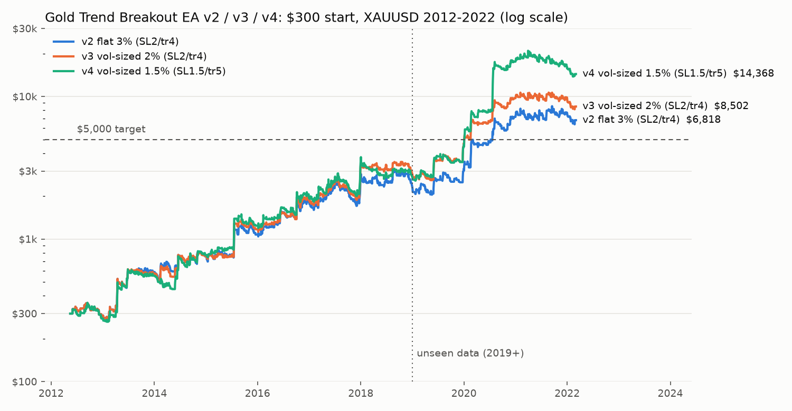

# Backtest results: EA_Gold_TrendBreakout v4 (XAUUSD)

**Data:** XAUUSD M15, May 2012 – Mar 2022 (~230k bars, broker server time GMT+2/+3), from
[ejtraderLabs/historical-data](https://github.com/ejtraderLabs/historical-data).
**Costs:** $0.35 spread + $7/lot commission per round trip. **Execution:** signals on H1, stops and trailing
walked through M15 bars. Lot size 0.01 min / 0.01 step, 100 oz contract, 1:100 leverage.
**Discipline:** every idea was tuned on 2012–2018 and judged on 2019–2022 (never used for selection
until the end). About 900 variants were tested in total; the search log is below.

**Strategy v4:** H1, fresh close beyond the 200-bar Donchian channel, stop **1.5×ATR(14)**, trailing stop
**5×ATR**, no fixed TP, one position. **Volatility sizing:** risk ×2 when weekly volatility < 0.8× its 1-year median.

## $300 starting balance

| Version / base risk | Final | Multiple | Max DD | $5,000 after | 2019–22 (unseen) |
|---|---|---|---|---|---|
| v2 flat 3% (SL2/tr4) | $6,818 | ×22.7 | −35.7% | 93 mo | ×3.0, DD −25% |
| v3 vol-sized 2% (SL2/tr4) | $8,502 | ×28.3 | −31.7% | 92 mo | ×3.0, DD −24% |
| v4 1% (Conservative) | $5,425 | ×18.1 | −28.5% | 98 mo | ×3.3, DD −23% |
| **v4 1.5% (Balanced)** | **$14,368** | **×47.9** | **−36.4%** | **92 mo** | **×5.4, DD −34%** |
| v4 2% (Aggressive) | $32,381 | ×107.9 | −45.8% | 68 mo | ×8.0, DD −43% |

Return per calendar year (%), $300 start:

|                               |   2012* |   2013 |   2014 |   2015 |   2016 |   2017 |   2018 |   2019 |   2020 |   2021 |   2022* |
|:------------------------------|-------:|-------:|-------:|-------:|-------:|-------:|-------:|-------:|-------:|-------:|-------:|
| v2 flat 3% (SL2/tr4)          |     -3 |    102 |     29 |     42 |     68 |     39 |     -7 |     34 |    130 |      7 |    -11 |
| v3 vol-sized 2% (SL2/tr4)     |     -3 |     98 |     32 |     54 |     59 |     62 |     -5 |     64 |    107 |      1 |    -13 |
| v4 vol-sized 1.5% (SL1.5/tr5) |     -8 |    100 |     40 |     61 |     57 |     65 |    -15 |     68 |    283 |    -10 |     -9 |

\* 2012 from May, 2022 to early March.

## $10,000 at 1.5% base risk
×46.8 (CAGR 48%), max DD −36.6%, 452 trades, win rate 29%, profit factor 1.59, average **+0.49R** per trade,
best trade +32.7R, longest losing streak 13.
**Monte Carlo** (5,000 reshuffles of the realised trade returns): median max DD −38%, 95th percentile −53%,
P(DD > 50%) 8.5%, P(DD > 70%) 0.1%.

## Why v4 beats v3: the stop-loss plateau
Cell = average R per trade, 2012–18 / 2019–22, H1 N200 (rough H1 simulation, 160-variant grid):

| Stop \ Trail | 3 ATR | 4 ATR | 5 ATR | 6 ATR |
|---|---|---|---|---|
| 0.75 ATR | +0.26 / +0.52 | +0.46 / +0.71 | +0.39 / +0.83 | +0.39 / +0.89 |
| 1.0 ATR | +0.28 / +0.44 | +0.47 / +0.66 | +0.46 / +0.77 | +0.51 / +0.77 |
| 1.25 ATR | +0.33 / +0.40 | +0.53 / +0.56 | +0.54 / +0.70 | +0.62 / +0.76 |
| **1.5 ATR** | +0.27 / +0.40 | +0.42 / +0.57 | **+0.45 / +0.75** | +0.51 / +0.83 |
| 2.0 ATR (v3) | +0.21 / +0.27 | +0.33 / +0.42 | +0.37 / +0.54 | +0.47 / +0.59 |

The whole region stop ≤ 1.5 / trail ≥ 4 beats v3 in both periods. In the precise M15 engine at matched
drawdown (~−33%), SL1.25/tr4 gives ×63 vs ×29 for v3. Trails of 7–8 ATR give back the gain (DD −56% to −68%).

### Spread stress, $10k, 1.5% base (why 1.5 ATR and not 1.25)
| Config | $0.35 | $0.60 | $0.80 | $1.00 |
|---|---|---|---|---|
| SL1.25 / tr4 | ×63, DD −34% | ×30, DD −41% | ×9, DD −47% | ×2.4, DD −59% |
| SL1.25 / tr5 | ×80, DD −40% | ×39, DD −46% | ×13, DD −49% | ×3.5, DD −63% |
| **SL1.5 / tr5 (v4)** | **×47, DD −37%** | **×29, DD −37%** | **×20, DD −44%** | **×13, DD −47%** |
| SL1.5 / tr4 | ×31, DD −30% | ×20, DD −33% | ×14, DD −41% | ×9, DD −45% |
| SL2.0 / tr4 (v3) | ×15, DD −26% | ×12, DD −27% | ×10, DD −28% | ×7, DD −30% |

A tighter stop makes costs matter more. v4 keeps most of the gain and still works at a $1.00 spread;
the EA's `MaxSpreadPrice` default is $0.60. The volatility rule holds for every stop width (SL1.25 flat ×36 → ×177 with it).

## Overfitting checks
* **Combinatorially symmetric cross-validation** (Bailey et al.) over the 80-variant N×stop×trail grid, 10 time
  blocks, 252 splits: **PBO = 0.34** (probability that the in-sample best ranks below median out-of-sample);
  median OOS rank of the IS-best = 0.56. Moderate: the grid is a plateau, so "which cell is best" is noisy, but
  the best cells are not below median OOS.
* **Deflated Sharpe ratio** of the full-sample best (N200/SL1.25/tr4, monthly Sharpe 1.06) against the expected
  maximum Sharpe from 80 skill-less trials (0.37): **DSR = 0.998**.
* Each component (tight stop, wide trail, volatility sizing) improves both the tuning and the unseen period on
  its own.

## Search log: what was tested and rejected
| Family (variants) | Best result | Verdict |
|---|---|---|
| Original M15 session EA (Asian breakout + EMA pullback) | −0.20R/trade after costs | rejected |
| Asian-range breakouts M15/H1, several exits (48) | unstable, negative on 2019–22 | rejected |
| RSI(2) mean reversion H1/H4/D1 (36) | negative after costs | rejected |
| Hour-of-day / weekday seasonality | ~1 bp edges, below costs, not persistent | rejected |
| LightGBM on 33 raw-price features, walk-forward (direct trading) | +0.06…+0.2R, unstable | rejected |
| LightGBM filter on breakouts → volatility rule (placebo-tested) | +0.77R / +1.48R on low-vol breakouts | **adopted as sizing rule** |
| Daily Donchian 10–80, D1 volatility breakout, D1 time-series momentum, H4 EMA pullback (115) | best +0.25R | weaker than H1 |
| H1 entry-hour windows (6) | NY-only +0.42/+0.44R but fewer trades; Asia-only 0 | not robust, rejected |
| Any-bar re-entry, opposite-signal exit, break-even, time stops (25) | opposite-exit −0.05R; others ≈ baseline | rejected |
| Pyramiding (Turtle adds, 24) | lower R per unit of risk than single entry | rejected |
| Stop width × trail × channel length grid (160 + 80) | stop 1–1.5, trail 4–6 plateau | **adopted** |
| ATR period 7–50 (18) | 14–20 best, 7 and 50 worse | kept 14 |
| Tick-volume confirmation (14) | +0.05R, inconsistent OOS by quartile | rejected |
| H2 / H4 channels with tight stops (96 rough, 12 precise) | H2 N150 SL1.0–1.25: highest R/trade (+0.60) but ×16–21 vs ×47 | rejected (fewer trades) |
| Portfolio of H1 + H4 + D1 + D1-VolBrk + RSI2 (20 combos) | H1+D1-VolBrk Sharpe 1.05 vs 0.99 alone, DD −19% vs −23% | marginal; not in EA |
| Threshold / multiplier / window of the volatility rule (14) | all beat flat in both periods | plateau confirmed |

## Ladder ticket simulation ($200 → $3,000 in 30 days)
See [`results/ladder/GTB_v4.md`](results/ladder/GTB_v4.md). Not achievable: the strategy takes ~3 trades per month.

## Caveats
* Bar-based simulation, not tick data. Slippage and weekend gaps can differ live. The EA has never been run in MT5
  by me; compile it, run it in the Strategy Tester on your broker's data, then demo.
* The data ends in March 2022. On a $300 standard account 0.01 lot may exceed the risk cap and the EA skips the
  trade. **Use a cent account, or $1,000+.**
* Trend-following: 29% win rate, losing streaks of 13, flat years (2018, 2021–22). Most profit comes from a few
  big trends (2013, 2016, 2020).

Reproduce: `python Backtest/gold_backtest.py --data XAUUSDm15.csv --balance 300 --risk 1.5 --out Backtest/results/v4_risk1.5`
then `cd Backtest && python make_report.py`. Research scripts: `Backtest/research/` (set `GOLD_M15_CSV`).
